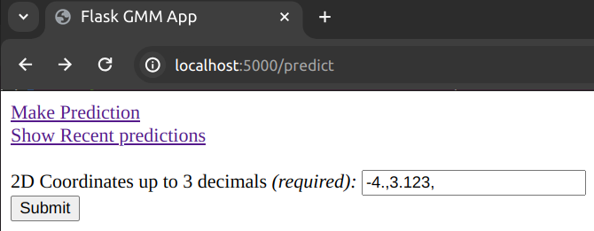
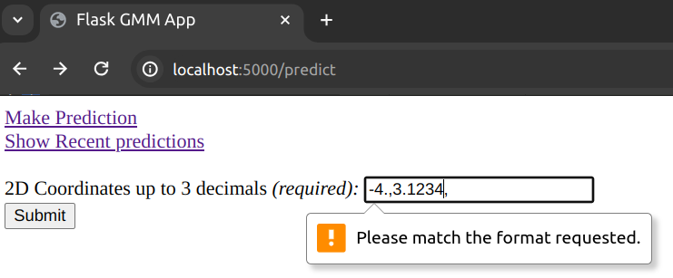
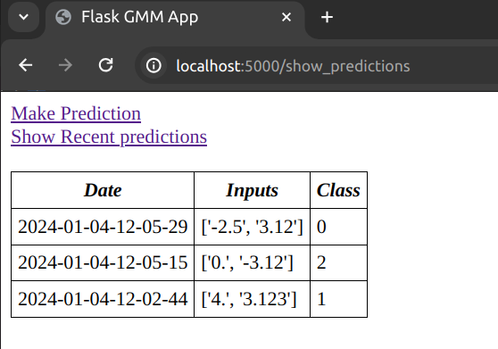

## Overview:
In this post I go over deploying a machine learning model on a Flask development server using Flask and Docker. The machine learning model is the Gaussian Mixture Model discussed in <a href="./2023-12-05-GMM.md">this</a> post. All the relevant code for the flask deployment can be found in my repo <a href="https://github.com/mariovas3/probabilistic_models/tree/master/flask_gmm">here</a>.

## Endpoints:
### The `/predict` endpoint:
The `/predict` endpoint gives a form to be filled:



The form is validated on the client side by requiring a regex match.
```html
<input type="text" name="coords" id="coords" value="-4.,3.123," required pattern="^(-?[0-9]\.([0-9]){0,3},){2}$"/>
```
It requires two comma-separated floats (and a trailing comma) up to 3 decimal places precision. This is because in the demo, the GMM works with 2d inputs.

Once the submit button is clicked, or alternatively curl is executed with appropriate flags:

```bash
curl -X POST -F coords=-4.,3.123, localhost:5000/predict
```

a json is returned of the type:

```
{
  "2024-01-08-08-55-54": "0"
}
```
denoting when the form data was read and `"0"` stands for the index of the group in which the inputs were classified by the model. So the json is `{"date": "predicted_class"}`.

#### Example of bad input:
Unless the input complies with the regex given above, we get a client side validation error. Here is an example of a client side validation error because a 4-decimal float was entered when we only support up to 3 decimal places.:




### The `/show_predictions` endpoint:
The `/show_predictions` endpoint gives a table recent predictions together with their inputs in reverse chronological order.



As we make `POST` requests, these are stored in a data structure in-memory together with their predictions from the model. The datastructure has a `max_len` data attribute giving the maximum capacity of the data store. When that capacity is reached and a new `POST` request is made, the oldest record is evicted from the data store. The logic for this data structure is shown in the code snippet below:

```python
from collections.abc import Iterable


class RecencyStore(Iterable):
    def __init__(self, max_len=10):
        self.max_len = max_len
        self.i = 0
        self.store = []

    def add_item(self, item):
        if len(self.store) < self.max_len:
            self.store.append(item)
        else:
            self.store[self.i] = item
        self.i = (self.i + 1) % self.max_len

    def __iter__(self):
        if len(self.store) == 0:
            yield None
        else:
            i = self.i - 1
            for j in range(len(self.store)):
                pos = (i - j) % len(self.store)
                yield self.store[pos]

    def __len__(self):
        return len(self.store)
```

If no `POST` requests have been made yet, an empty table will be displayed.

The links to the `/predict` and `/show_predictions` endpoints are given as a navigation list on each page.

## Running the server:
As mentioned earlier, I use a Docker container to run the flask sever and expose its relevant port to be accessible from my machine. I also use a multistage build to lower the size of the image, taking only the relevant files from the first stage. The relevant Dockerfile is given below.

```docker
FROM python:3.10.13-slim as builder

WORKDIR /model

COPY requirements-gmm-flask.txt .

RUN pip wheel --no-cache-dir --no-deps --wheel-dir /model/wheels -r requirements-gmm-flask.txt

FROM python:3.10.13-slim

WORKDIR /model

COPY --from=builder /model/wheels /wheels
COPY --from=builder /model/requirements-gmm-flask.txt .

RUN pip install --no-cache /wheels/*

WORKDIR /model/probabilistic_models

CMD ["python3", "-m", "pytest"]
```

As you can see, the default command is to execute all tests in the `probabilistic_models` repo with `pytest`. This is not necessary for this project in particular, so we shall overwrite the `CMD` in runtime.

Navigate to the `probabilistic_models` directory and build the docker image from the Dockerfile using:

```bash
DOCKER_BUILDKIT=1 docker build -t mixture-models-flask -f Dockerfile-gmm .
```

and then again from that directory run the container in interactive mode overriding the `CMD` with `bash` like so:

```
docker run -v $PWD:/model/probabilistic_models -it -p 5000:5000 --name flask-cont mixture-models-flask bash
```

This will start a terminal emulator inside the container. Then to save a trained GMM model you should run the fit-predict test like so:

```bash
python3 -m pytest tests/test_gmm_server.py::test_fit_predict
```

from inside the container terminal session.

The code above will generate a `gmm.joblib` file in the `flask_gmm` directory with the serialised trained model.

Finally, to start the flask development server you should run the command:

```bash
flask --app flask_gmm/app.py --debug run --host 0.0.0.0
```

again from inside the container.

Now you should be able to see the `/predict` webpage if you type `localhost:5000/predict` in your web browser.

> **Note:** For full details about the model serialisation and the flask application file see the <a href="https://github.com/mariovas3/probabilistic_models/tree/add-links-main-readme/flask_gmm">repository</a>.