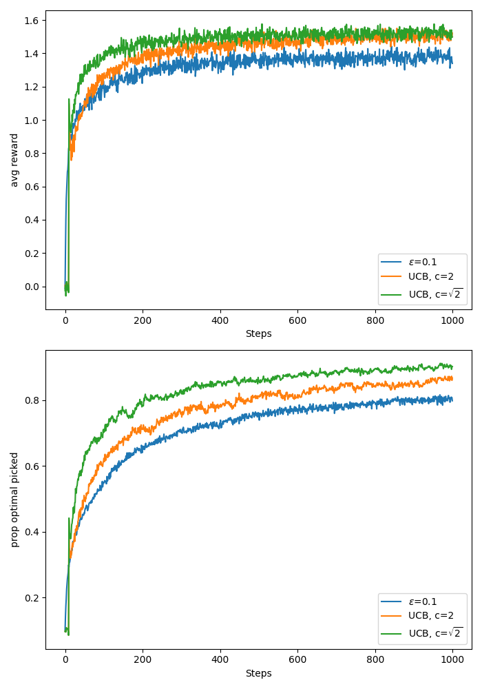
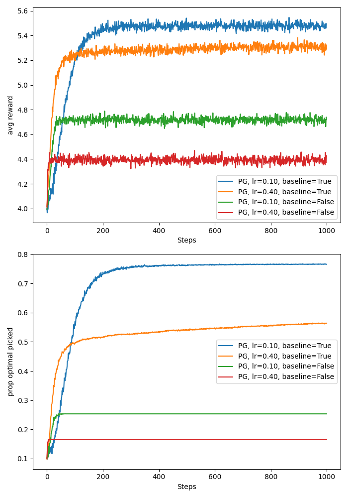
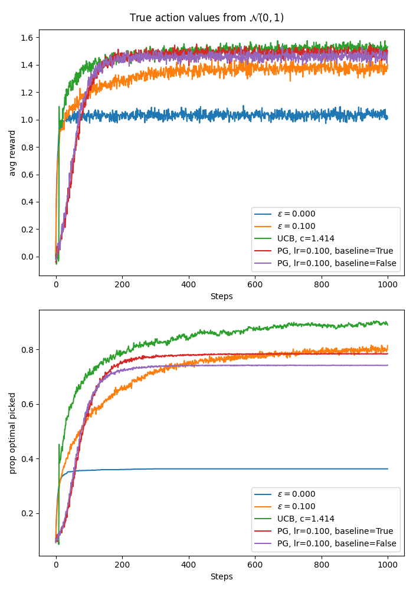

## Overview:
In this post I will cover various algorithms for bandit problems. The algorithms will be *greedy*, *epsilon-greedy*, *Upper Confidence Bound (UCB)*, and *gradient bandits*. The experiments are mostly reproduce results from the Sutton and Barto book. The code for the experiments can be found <a href="https://github.com/mariovas3/rl-algos/tree/master/src/bandits">here</a>.

## Bandit Problem setup:

This post will be tackling the non-associative bandit case. That is, there is only one state and it is constant. The experiment results I will show will also cover stationary bandit problems, and comments for the non-stationary case will be given.

For completeness, associative search (or contextual bandit) problems can be thought of as a probabilistic mixture of multiarmed bandit problems. That is with some probability you pick a multiarmed bandit problem from some pool of bandit problems at each time step. The probability distribution for selecting the bandit problem can change if the problem is non-stationary.

### Notation:
* $$\mathcal{A}$$ - set of actions.
* $$A_t\in \mathcal{A}$$ - action taken at time $$t$$.
* $$R_t$$ - reward received at time $$t$$.
* $$\pi_\theta$$ - policy parameterised by parameter vector $$\theta$$.
* $$q_*(a)$$ - true expected reward of action $$a$$.
* $$Q_t(a)$$ - estimated expected reward of action $$a$$ at time $$t$$.
* $$N_t(a)$$ - count of times action $$a$$ was chosen up to time $$t$$.

### Summary of stationary non-associative bandit problem:
> * Episodes of length one, constant state at each time step. 
> * Find a behaviour/policy/algorithm that maximises expected reward over some time horizon, $$T$$.
> * The decision making is usually implicit and based on estimates of usefullness/values of actions. 
> * You have to figure out how to trade off exploitation and exploration so you don't miss out on good actions that have been underexplored. Incorporating uncertainty in your decision-making might prove useful, therefore.
> * Many bandit algorithms resemble value-based RL algorithms, in that they maintain estimates of usefulness of actions.

### Objective:
Find $$\pi^*$$ such that:

$$
\begin{equation}
    \pi^*=\arg \max_{\pi} \sum_{t=1}^T \mathbb{E}_{A_t\sim \pi} \left[\mathbb{E}[R_t \mid A_t=a_t]\right].
\end{equation}
$$

If I knew $$ \mathbb{E} [R_t\mid A_t=a] $$ for all $$a_t\in \mathcal{A}$$ and for all $$t$$, I can just pick the policy $$\pi^*$$ that implements a greedy operation:

$$
\begin{equation}
    a_t^* = \arg \max_a \mathbb{E}[R_t|A_t=a].
\end{equation}
$$

Since the expectations are unknown, we have to estimate them and potentially use extra heuristics to pick an action.

## Epsilon greedy:
These are methods only based on estimates (or proxies) of $$\mathbb{E}[R_t\mid A_t=a]$$ for all $$a\in \mathcal{A}$$. 

No uncertainty is taken into account. To balance exploitation and exploration we forcefully make a uniformly random action selection with probability $$\epsilon$$. This is known as $$\epsilon$$-greedy strategy. 

If the estimate of the expectation is the sample average reward for each action, the hope is that if the bandit is stationary, as $$ T\rightarrow \infty$$, we explore each action infinitely often and by the Law of Large Numbers the sample means of rewards per action converge to the true expectations of rewards for each action.

If we have $$\mid \mathcal{A}\mid$$ actions, we pick greedy action/exploit with probability $$1-\epsilon + \epsilon \times \mid \mathcal{A}_t^{\text{greedy}}\mid / \mid \mathcal{A}\mid$$. The probability of non-greedy action is $$\epsilon \times (\mid\mathcal{A}\mid - \mid\mathcal{A}_t^\text{greedy}\mid)/ \mid\mathcal{A}\mid$$,  assuming $$\mathcal{A}^\text{greedy}_t \subseteq \mathcal{A}$$ is the set of greedy actions at time $$t$$ (dependent on value estimates at time $$t$$, $$Q_t(a)$$).

The action values are usually updated using a version of stochastic gradient descent on the MSE of $$\mathbb{E}[(R - Q(A_t))^2\mid A_t]$$, with respect to $$Q$$.
The update is:

$$
\begin{equation}
    Q_{t+1}(a) = Q_t(a) + \alpha_t(a)(R_{t+1} - Q_t(a)),
\end{equation}
$$

where $$\alpha_t(a)$$ is the learning rate, $$a$$ was the action taken at time $$t$$, and $$Q_t(a)$$ is the estimate of action $$a$$ at time $$t$$. This is the same as SGD on the MSE with respect to $$Q$$, having sampled $$R_{t+1}$$.

### Sample average estimates:

We get the sample average estimates when:

$$
\begin{equation}
    \alpha_t(a)=\frac{1}{N_{t}(a)}.
\end{equation}
$$

### Robbins-Monro and tracking estimates:

The Robbins-Monro conditions guarantee convergence to the true action values. Therefore, sometimes we get time-varying learning rates that satisfy:

$$
\begin{align}
    \sum_t^\infty \alpha_t(a) &\rightarrow \infty\notag\\
    \sum_t^\infty \alpha_t(a)^2 &< \infty.
\end{align}
$$

Even if the Robbins-Monro conditions are satisfied, however, convergence can be slow and tough to tune a good learning rate decay. 

Instead of a decaying learning rate, we might just opt in for an exponentially moving avg with constant learning rate $$\alpha\in (0, 1]$$. This is a form of tracking since the relevance of past rewards decays by a factor of $$(1-\alpha)$$ each time step. And if $$\alpha=1$$, the action value estimate is the newest reward. This is decent for nonstationary problems and usually works well.

### The ten armed testbed setup:

In this experiment we aggregate results from 2000 10-armed bandits. Unless stated otherwise, the true action values are sampled from a standard Gaussian, $$\mathcal{N}(0, 1)$$, and the rewards are sampled from a Gaussian with the sampled values as means and variance 1.

$$
\begin{align}
    R_t &\sim \mathcal{N}(q_*(A_t), 1)\\
    q_*(a)&\sim \mathcal{N}(0, 1)\quad \forall a\in\mathcal{A}.
\end{align}
$$

We track the average reward at each time step as well as the proportion of bandits in which the true optimal action was selected - averaged over the 2000 bandit problems.

Unless stated otherwise, the initial value estimates at $$t=0$$ are zeros, $$Q_0(a)=0$$, $$\forall a\in \mathcal{A}$$.

### Ten-armed testbed greedy vs epsilon greedy:

Here I have reproduced the 10-arm testbed from the Sutton and Barto book. I get the same results, see image below. The code is in <a href="https://github.com/mariovas3/rl-algos/tree/master/src/bandits/epsgr_vs_gr.py">here</a>.

Based on the plot we see that the epsilon greedy algorithm with $$\epsilon=0.1$$ explores the most aggressively and learns a behaviour that significantly surpasses the other algorithms quickly. Due to the constant exploration probability, however, we will pick a random action every $$10^{th}$$ step regardless of how good our estimates may already be. That being said, it is likely that in the long run the $$\epsilon =0.01$$ algorithm will reach the best average reward since the probability of random action selection will be lower. 

The greedy algorithm sticked to the action it thought was best early on, so unless that was the optimal action, it incurs linear regret until the end of the experiment.

### Optimistic initial values:

In order to encourage exploration in the beginning of the experiment we can initialise the action value estimates larger than we expect them to be. This way, after trying any action in the beginning the feedback will be disappointing, leading to exploration of the other actions.

This only encourages early stage exploration, however, so is not a remedy for non-stationary problems.

In the figure below I test the usefulness of optimistic initial action value with a greedy algorithm versus epsilon greedy with $$\epsilon = 0.1$$ and zero initial action value. For the optimistic action value I initialise at 5. This should be optimistic enough since my bandits sample rewards from a Gaussian with standard deviation 1 and mean sampled from a standard Gaussian.

If we use sample averaging as in the previous experiment, the bias of the initial value will be eliminated after the first trial of the action (see formula above). 

In order to see a prolonged effect of the initial value, I use tracking of action values with constant learning rate of $$\alpha = 0.1$$ as in the example in the Sutton and Barto book. 

As we can see, for this problem we made the greedy algorithm explore a lot more in the early stage due to the optimistic initial values and the early stage "disappointment" from the actions. After step 200, however, we see that the greedy algorithm begins to outperform the epsilon-greedy strategy in both average reward and proportion of true optimal action picked. The code for this experiment can be found <a href="https://github.com/mariovas3/rl-algos/blob/master/src/bandits/optimistic_init.py">here</a>.

## Upper Confidence Bound (UCB):
This is an algorithm that aims to trade off the potential advantage of selecting an action with a high action value estimate against the uncertainty in that action.

There is an intuitive motivation for this algorithm. Suppose the action with the greatest action value estimate has small uncertainty about it, and you have some other action whose estimate is close but less than that of the current greedy action and had greater uncertainty about the estimate (underexplored action). If the uncertainty of the latter is sufficiently large, it is likely that the true action value of the latter might be greater than that of the current greedy action.

The selection rule is:

$$
\begin{equation}
    A_t = \arg \max_{a\in \mathcal{A}}\quad Q_t(a) + U_t(a),
\end{equation}
$$

where

$$
\begin{equation}
    U_t(a) = c\sqrt{\frac{\log t}{N_t(a)}}.
\end{equation}
$$

The $$c$$ is a tunable parameter, but in the paper <a href="https://homes.di.unimi.it/~cesabian/Pubblicazioni/ml-02.pdf">Auer et.al 2002</a>, $$c=\sqrt{2}$$ is shown to lead to logarithmic expected total regret. The $$N_t(a)$$ is the number of times action $$a$$ was selected up to time $$t$$. The $$Q_t(a)$$ is the sample average reward from playing $$a$$ up to time $$t$$. The derivation is based on the Hoeffding inequality utilising bounded rewards in $$R_t \in [0, 1]\quad \forall t$$. Note that the general case for bounded rewards $$R_t\in [b1, b2]$$ can be reduced to the $$R_t\in [0, 1]$$ case by e.g., 

$$
\begin{equation}
    \tilde{R}_t=\frac{R_t-b1}{b2-b1},
\end{equation}
$$

so no generality is lost.

I reproduced the plot from the Sutton and Barto book and also added the curves for UCB with $$c=\sqrt{2}$$ because I was curious how this would perform, given the theoretical results. It seems UCB with $$c=\sqrt{2}$$ indeed performs best on the 10 arm test bed as shown in the plot below. Code available <a href="https://github.com/mariovas3/rl-algos/blob/master/src/bandits/ucb_vs_epsgr.py">here</a>.

Caveats:
* UCB is not great for non-stationary problems since after a lot of time, the algorithm would have settled on what actions are good and will not be influenced a lot by the uncertainty term $$U_t$$ (log in $$t$$). This 
makes the decision making dominated by being greedy on the action-value estimates $$Q_t(a)$$. This behaviour resembles the greedy algorithm behaviour after initial exploration. On the other hand, the epsilon greedy might adapt faster due to its foceful exploration with constant probability epsilon.
* Implementing UCB for large state-spaces is also tough, how do you track counts of the actions with function approximation?!

## Policy Gradient Bandits:
Since we are in the bandits case, we only have one state, so when we define an explicit policy, $$\pi_\theta$$, it is usually parameterised by a parameter vector, $$\theta$$, and maintains an internal state that summarises preference to the different actions. In the full RL problem, the policy usually takes as input the state or some summary thereof to update its internal state accordingly.

If the policy is stochastic, it is common to output a distribution over actions from which we can sample. If the policy is deterministic, it directly performs some deterministic operation based on its internal state (given by $$\theta$$).

In this section I will cover a stochastic shallow softmax policy, designed to work for finite action spaces. Suppose we have a particular enumeration of actions $$(a_i)_{i}^{\mid\mathcal{A}\mid}$$ and that the $$i^{th}$$ element of the parameter vector $$\theta$$, $$\theta_i$$, corresponds to the preference for the $$i^{th}$$ action according to the enumeration. Based on $$\theta$$, the policy maintains a distribution over actions:

$$
\begin{equation}
    \pi_\theta(a_i)=\frac{
        e^{\theta_i}
    }{\sum_{j=1}^{|\mathcal{A}|} e^{\theta_j}}.
\end{equation}
$$

Since the episodes in bandit problems are of length one, it makes sense to use the single step expected reward as the objective to be maximised with respect to the parameter vector $$\theta$$. The expectation can be written as:

$$
\begin{align}
    \mathbb{E}^{\pi_\theta}[R_t]&=\sum_{i=1}^{|\mathcal{A}|}\pi_\theta(a_i) \mathbb{E}[R_t|A_t=a_i]\notag\\
    &=\sum_{i=1}^{|\mathcal{A}|}q_*(a_i)\pi_\theta(a_i),
\end{align}
$$

where $$q_*(a_i):=\mathbb{E}[R_t\mid A_t=a_i]$$ is the true, but unknown expected reward for the $$i^{th}$$ action according to the chosen enumeration.

As with policy gradients we use the REINFORCE trick to make the actual gradient into an expectation of an expression containing the gradient of the log policy. We also note that given the softmax policy, one can show that

$$
\begin{equation}
    \sum_{i=1}^{|\mathcal{A}|}\frac{\partial \pi_\theta(a_i)}{\partial \theta_k}=0,
\end{equation}
$$

so adding a baseline that does not depend on the actions does not change the gradient of the expected reward

$$
\begin{align}
    \frac{\partial \mathbb{E}^{\pi_\theta}[R_t]}{\partial \theta_k}&= 
    \sum_{i=1}^{|\mathcal{A}|}q_*(a_i)\frac{\partial \pi_\theta(a_i)}{\partial \theta_k}\notag\\
    &=\sum_{i=1}^{|\mathcal{A}|}(q_*(a_i) - B_t)\frac{\partial \pi_\theta(a_i)}{\partial \theta_k}.
\end{align}
$$

There is research on optimal choices of a baseline, however, the simple sample average of all rewards up to but not including the current, is easy to compute and often works well.

After using the REINFORCE trick we get:

$$
\begin{align}
    \frac{\partial \mathbb{E}^{\pi_\theta}[R_t]}{\partial \theta_k}&=
    \mathbb{E}_{A_t\sim\pi_\theta}\left[(q_*(A_t) - B_t)\frac{
        \partial \log \pi_\theta(A_t)
    }{\partial \theta_k}\right]\notag\\
    &=\mathbb{E}\left[
        (R_t-B_t)\frac{
        \partial \log \pi_\theta(A_t)
    }{\partial \theta_k}
    \right] && \text{(iterated expectations)}\notag\\
    &=\mathbb{E}\left[
        (R_t-B_t)(1_{A_t=a_k} - \pi_\theta(a_k))
    \right].
\end{align}
$$

We can sample the above expectation (first sample $$A_t\sim \pi_\theta^{(t)}$$, then receive reward $$R_t$$) to get a stochastic gradient ascent update:

$$
\begin{align}
    \theta_k^{(t+1)}&\leftarrow \theta_k^{(t)} + \alpha (R_t-B_t)(1-\pi_\theta^{(t)}(a_k))  && \text{, if $A_t=a_k$}\\
    \theta_k^{(t+1)}&\leftarrow \theta_k^{(t)} - \alpha (R_t-B_t)\pi_\theta^{(t)}(a_k)  && \text{, otherwise.}
\end{align}
$$

The insight from the above updates is that if the current reward received as a consequence of picking $$A_t$$ is greater than the baseline, $$B_t$$, we increase the probability of picking the same action later and decrease the probabilities of the other actions. If the current reward is less than $$B_t$$, the opposite is true.

In the plot below I show the average reward and the proportion of times the true best action was selected by the above algorithm. The experiment setup is again based on the ten armed testbed, only this time each action's mean reward is sampled from $$\mathcal{N}(4, 1)$$ rather than $$\mathcal{N}(0, 1)$$. This is so that we can more clearly see the defference in performance of the algorithms with and without a baseline. As in the 10 arm testbed, we have 2000 bandits each with 10 arms.

I test four settings of the gradient bandits algorithm:
* learning rate = 0.1, with baseline,
* learning rate = 0.1, without baseline,
* learning rate = 0.4, with baseline,
* learning rate = 0.4, without baseline.

Based on the plot below (code <a href="https://github.com/mariovas3/rl-algos/blob/master/src/bandits/pg_bandits.py">here</a>), we see that the algorithms with baselines performed much better than their counterparts without baselines. The intuition behind this is that, in the case of the without baseline the baseline is effectively 0, but since the true mean rewards for each action is sampled from $$\mathcal{N}(4, 1)$$ and the subsequent samples are drawn from a Gausssian with variance 1, it is extremely unlikely to get rewards below 0. This results in always increasing the probability of the selected action and decreasing the probabilities of the remaining actions. This also leads to much slower/noisy learning because it is difficult to discern good actions from bad actions. On the other hand, in the case with baselines, after an action is tried on the first time step, the baseline becomes equal to the reward from that action, and unless the following actions lead to better rewards, their probabilities will be decreased. Moreover, as we sample more from the best action, the baseline will tend to the mean reward of the best action, making it ulikely for suboptimal actions to increase their probability of selection.

## Comparison of all algorithms:
Below I have created two plots (code <a href="https://github.com/mariovas3/rl-algos/blob/master/src/bandits/all_algos.py">here</a>)comparing greedy, epsilon greedy with $$\epsilon=0.1$$, UCB with $$c=\sqrt{2}$$, gradient bandit with $$\text{lr}=0.1$$ with baseline, and gradient bandit with $$\text{lr}=0.1$$ without baseline. The first plot has the true action values sampled from $$\mathcal{N}(0, 1)$$ while the second plot is an experiment where the true action values were sampled from $$\mathcal{N}(4, 1)$$. In both plots the initial action value estimates, where relevant, were initialised to zeros.

The UCB seems to win in both settings. In the first setting both gradient bandits seem to perform slightly better than epsilon greedy in terms of average reward and both slightly worse than epsilon greedy in terms of proportion of times the true optimal action was selected. The greedy algorithm performs the worst in this experiment.

A big difference in performance again arises when we change the setup to sample true action values from $$\mathcal{N}(4, 1)$$. Similar to the plot where we compared gradient bandits only, here the gradient bandit without baseline again did much worse. The worst performing algorithm here, however, is the greedy algorithm. The intuition for the bad performance of the greedy algorithm is that due to low initial values $$Q_0=0$$, and the relatively higher true values $$q_*(a)\sim \mathcal{N}(4, 1)$$, the first action tried is likely the one the greedy algorithm gets stuck with. This is because there is no incentive to explore since it is extremely unlikely to sample negative rewards from $$\mathcal{N}(m\sim\mathcal{N(4, 1)}, 1)$$. So unless the first action tried is the best action, the greedy algorithm is just stuck with a suboptimal action and incurs linear regret.

